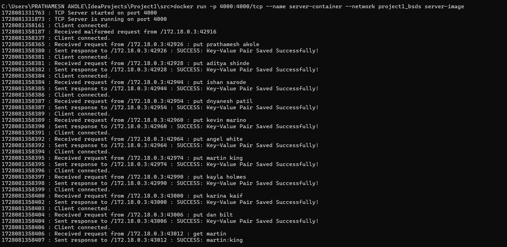
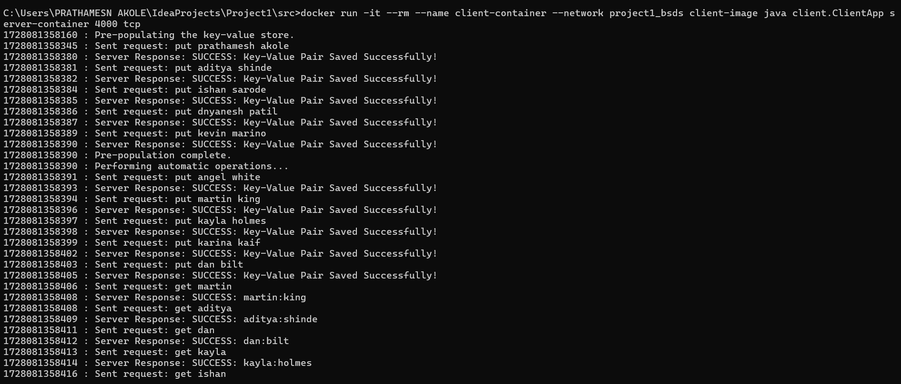
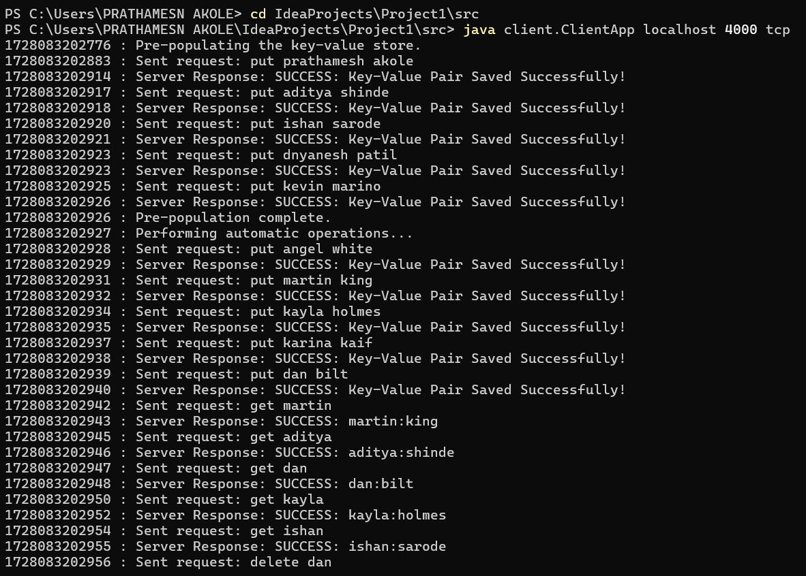
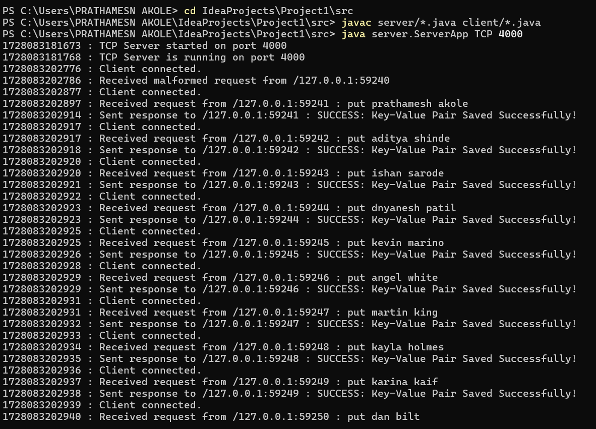

# **Project 1**

**By Prathamesh Akole**

## Steps to follow to run the app with Docker : 

### Step 1
1. Unzip all the files.
2. Open the Dockerfile and insert the `<protocol>` and `<port_number>` in the last line.
   >`For e.g. CMD ["java", "server.ServerApp", "TCP", "4000"]`

   If you want TCP server to listen on port 4000.
2. Open two tabs of Command Prompt/Terminal.
3. Navigate to the src folder in the terminal in both of them.
4. In the first window run the ***Create custom network*** command with the network name already given as
   the other commands are written with the given network name.
4. Then on the same window run the ***Build Server Image*** command given below and then run the *Run Server* command
of desired protocol(TCP/UDP).
5. Replace the `<port_number>` with the desired port number.
6. The server will return a response when it is up and running.

### Step 2

1. On the other tab of terminal run the ***Build Client Image*** command given below.
2. Then run the ***Run Client*** command of the desired protocol(TCP/UDP) and replace the `<port_number>` 
with the desired port number.
3. The client will display a response when connected to the server in case of TCP. In case of UDP
the client will send a dummmy packet to test if the packets are being sent.

### Details

1. The client after the connection is established will pre-populate the data store with 5 key value pairs
2. The client will also perform `5 GET, 5 PUT and 5 DELETE` operations on the key value store.
3. The client will then allow the user to perform operations on the key value store.
4. Type `exit` as the command to exit from the client.
5. To force exit the server press *`Control + C / Command + C`* 

### Miscellaneous Notes

1. The Key and Value are of `String` data type.
2. The `client_log`and `server_log` files contain the logs of client and server respectively.

## Docker Commands

### Network

**Create a Custom Virtual Network**

>`docker network create project1_bsds`

### Server

**Build Server Image**
>`docker build -t server-image --target server-build .`

**Run TCP Server**
>`docker run -p <port_number>:<port_number>/tcp --name server-container --network project1_bsds server-image`

**Run UDP Server**
>`docker run -p <port_number>:<port_number>/udp --name server-container --network project1_bsds server-image`

### Client

**Build Client Image**
>`docker build -t client-image --target client-build .`

**Run TCP Client**
>`docker run -it --rm --name client-container --network project1_bsds client-image java client.ClientApp server-container <port_number> tcp`

**Run UDP Client**
>`docker run -it --rm --name client-container --network project1_bsds client-image java client.ClientApp server-container <port_number> udp`

## Commands to run app on terminal without Docker :

1. Open two `Command Prompt/ Terminal` windows.
2. Compile the code using `javac server/*.java client/*.java`
3. Run the *server* using command
   >`java server.ServerApp <protocol> <port-number>`
4. Run the *client* using the command
    >` java client.ClientApp <host_name> <port_number> <protocol>`

## Screenshots ### App running on local 

1. **Running TCP Server on Docker**

2. **Running TCP Client on Docker**

3. **Client running on local environment**

4. **Server running on local environment**
